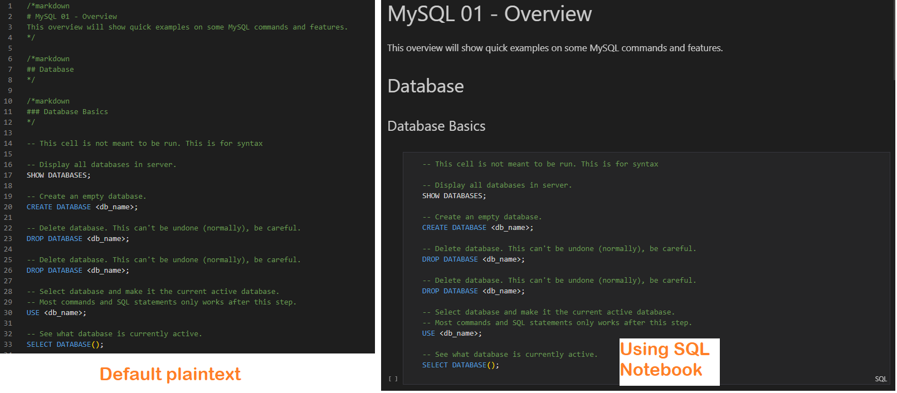

# My MySQL Notes

This is my personal notes on MySQL, styled in a way as a tutorial. The notes contains basic syntax and workings of MySQL. MySQL is just a flavor of SQL, and most concepts and syntax may apply to other variants of SQL.

Due to the nature of using an extension for note taking, formatting may break randomly which results into weird formatting, all lines are separated into their own cells, or everything is put into one giant cell. The extension creator is aware of the problem, and may be adressed soon.

## Prerequisites

- MySQL ([Install guide](https://dev.mysql.com/doc/mysql-installation-excerpt/5.7/en/)) (Version used here is 8.0.33)
- Visual Studio Code
- VScode Extension: [SQL Notebook](https://marketplace.visualstudio.com/items?itemName=cmoog.sqlnotebook) by cmoog.

## Opening Notes

By default, the notes are opened in the default plaintext format. To open in notebook style:

1. Right click the .sql file to be opened.
2. Select "Open With..." in the context menu.
3. Select SQL Notebook. You may also select this as default in this step.

## Using Notes

The actual notes are the ones named mysql_xx.sql (e.g. mysql_04.sql). SQL Notebook allows us to run individual cells, which is useful for seeing what each statement do. Some cells contains syntax only, and is not supposed to be run.

To run cells, a database connection needs to be configured first, which can be done through the SQL Notebook view on VSCode's side bar (left side by default).

## TODO

- Add table of contents
- Add content